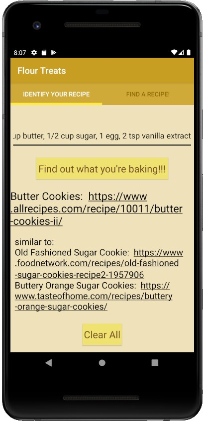

# Flour Treats
###Recipe Identifier
- Takes in list of ingredients, separated by commas
- Returns list of similar baked goods (Ex. cookie, muffin, or cake) along with links to how to properly make the good
- Implements fragments to create tabs
- Parses data from a csv file
- Uses K-nearest neighbor algorithm to classify the list of ingredients

###Find a Recipe
- Search Bar to find a recipe for any baking good one would want to make

